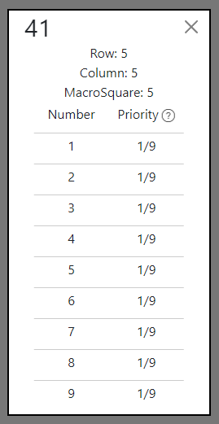
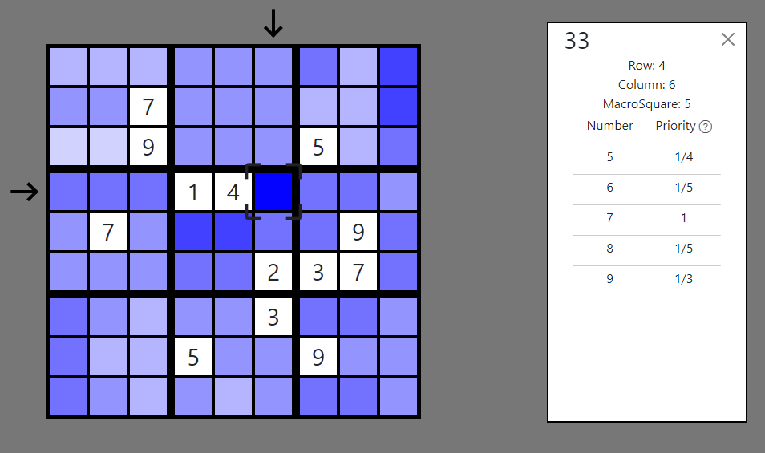

# About

Have you ever tried to fill the Sudoku board with numbers from scratch? If you have, you can probably admit that it is not an easy task, especially if you don't know the algorithm how to do this. In responce to your problem, Sudoku Helper comes to the rescue.

Sudoku Helper can also help you solve the Sudoku puzzles.

# Rules

The rules for filling the Sudoku board in Sudoku Helper are standard.

There is the board cosisting of the 3x3 "Macro-Squares" which are the 3x3 board of "Squares".
There can only be one number from 1 to 9 in each column, row and "Macro-Square".

# How to fill board?

When the page loads you will see the blank board.

When you click one the square you will see the panel which should you help with the filling the board.
The panel is consistig of the id of the square. Id is the number between 1 and 81. It is calculated from the formula:
  
Id = row_id\*9 + column_id
  
<b>row_id and column_id are counted from 0.</b>
  
Under the id of the square are the number of row, column and "Macro-Square" counted from 1 and under these there is the clue of this panel - "Priorities".
 

## Priorities

Priorities are indicators of how many squares in column or row or "Macro-Square" number can be placed. The highes priority is 1. It means that for example the 4 number MUST BE in this square, not others, otherwise there will be no way to fill the Sudoku board correctly.

The user should input a number with the greatest priority.

The high priority of entering some number is manifesting on the board by the blue color. The higher the priority is, the more intense the blue in the square will be.
 

# Enjoy!!!
