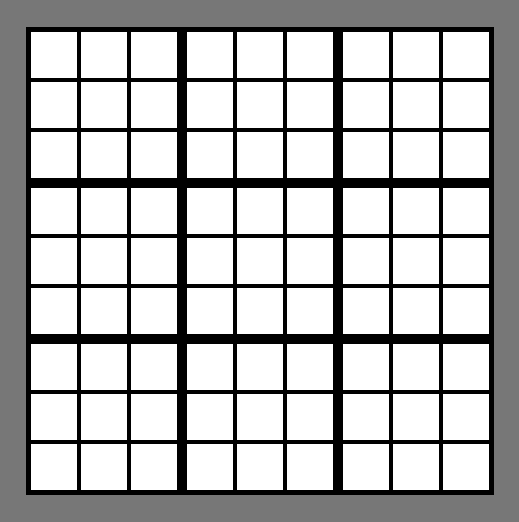

# About

Have you ever tried to fill the Sudoku board with numbers from scratch?
If you have, you can probably admit that it is not an easy task, especially if you don't know the algorithm how to do this.
In response to your problem, Sudoku Helper comes to the rescue.

Sudoku Helper can also help you solve the Sudoku puzzles.

# Rules

The rules for filling the Sudoku board in Sudoku Helper are standard.

There is a board cosisting of 3x3 "macro-squares" which are the 3x3 board of "squares".
There can only be one number from 1 to 9 in each column, row and "macro-square".

# How to fill board?

When the page loads you will see the blank board.

## Panel

When you click on one of the squares, you will see the panel that will help you fill in the board.
The panel is consists of the id of the squares. This id is the number between 1 and 81. It is calculated from the formula:
  
Id = row_id\*9 + column_id
  
<b>Row_id and column_id are counted from 0.</b>
  
Below the id of the square are the number of row, column and "macro-square" counted from 1 and below these that is the main part of this panel - "Priorities".
  

## Priorities

Priorities are indicators of how many squares in column or row or "macro-square" number can be placed. The highest priority is 1.
This means that for example that the 4 number <b>MUST BE</b> in this square, not other numbers, otherwise there will be no way to fill the Sudoku board correctly.

The user should input a number with the highest priority.

The high priority of entering some number is manifesting on the board by the blue color.
The higher the priority is, the more intense the blue in the square will be.
  

# Enjoy!!!
